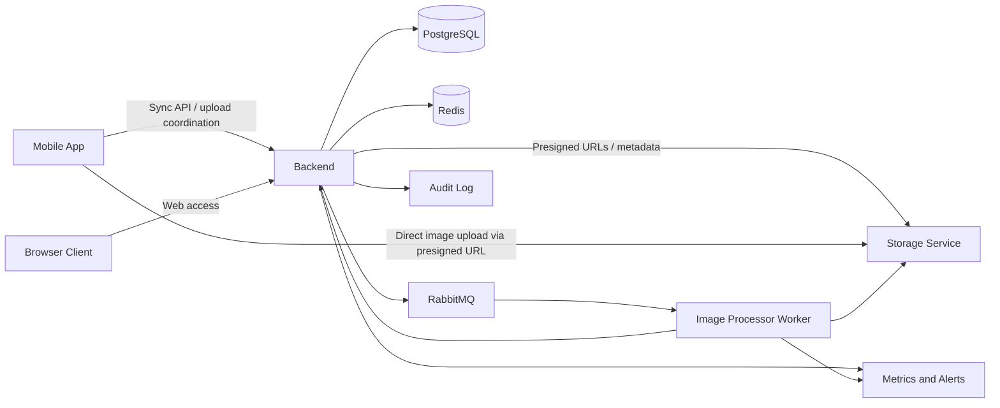
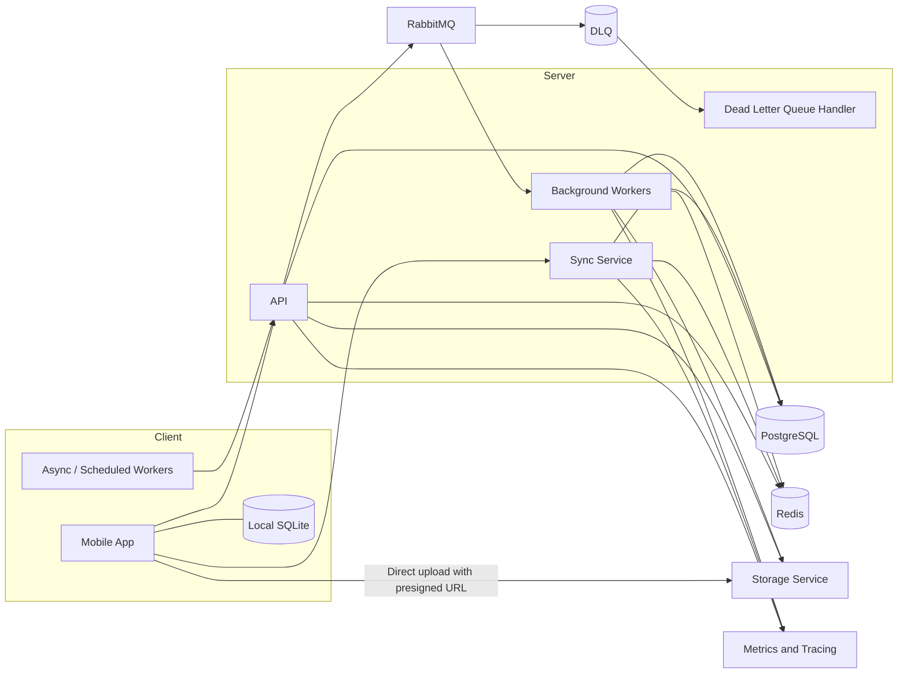
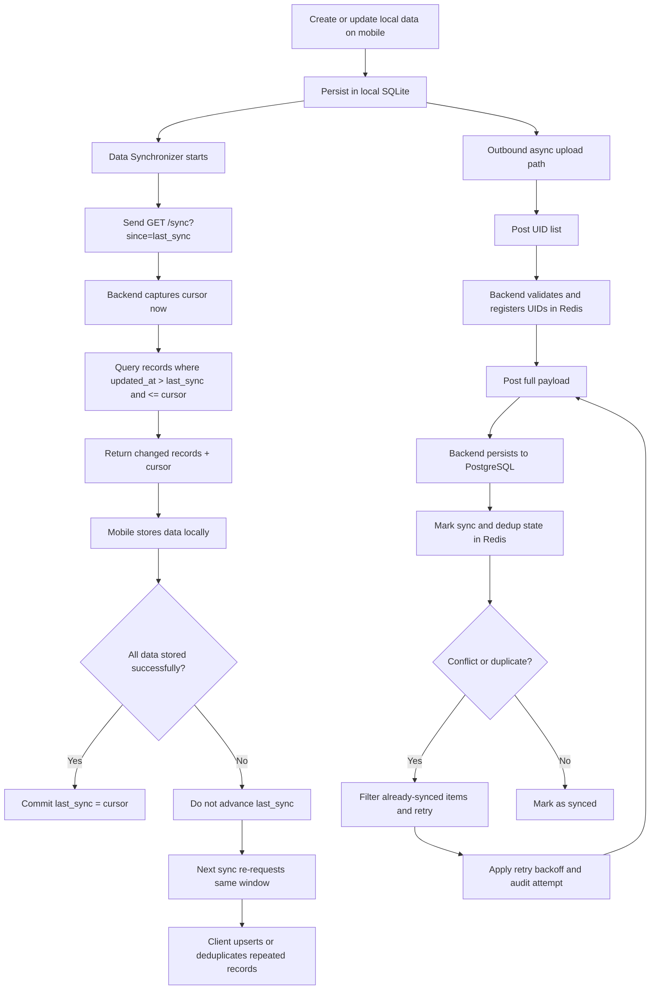
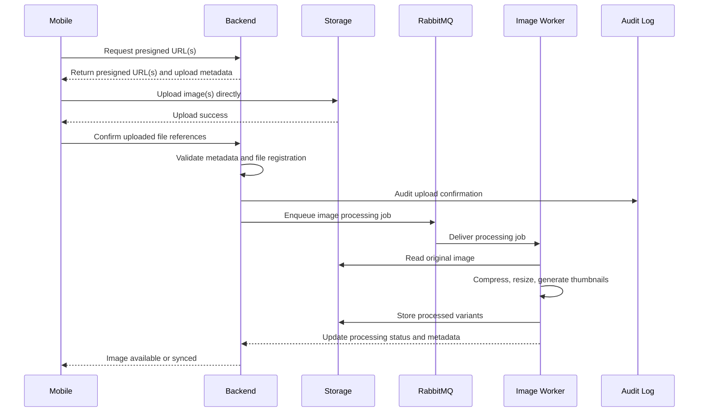
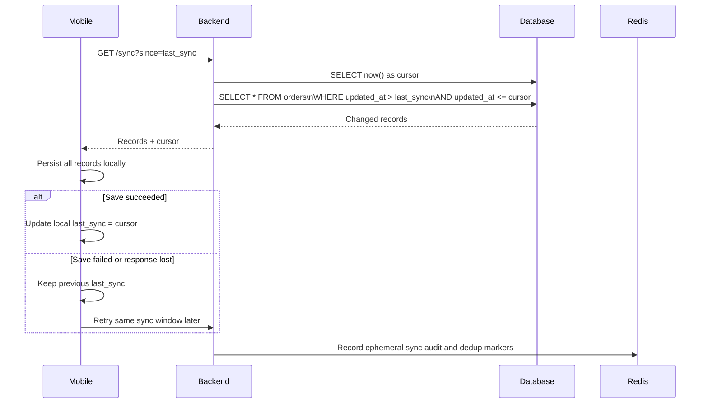
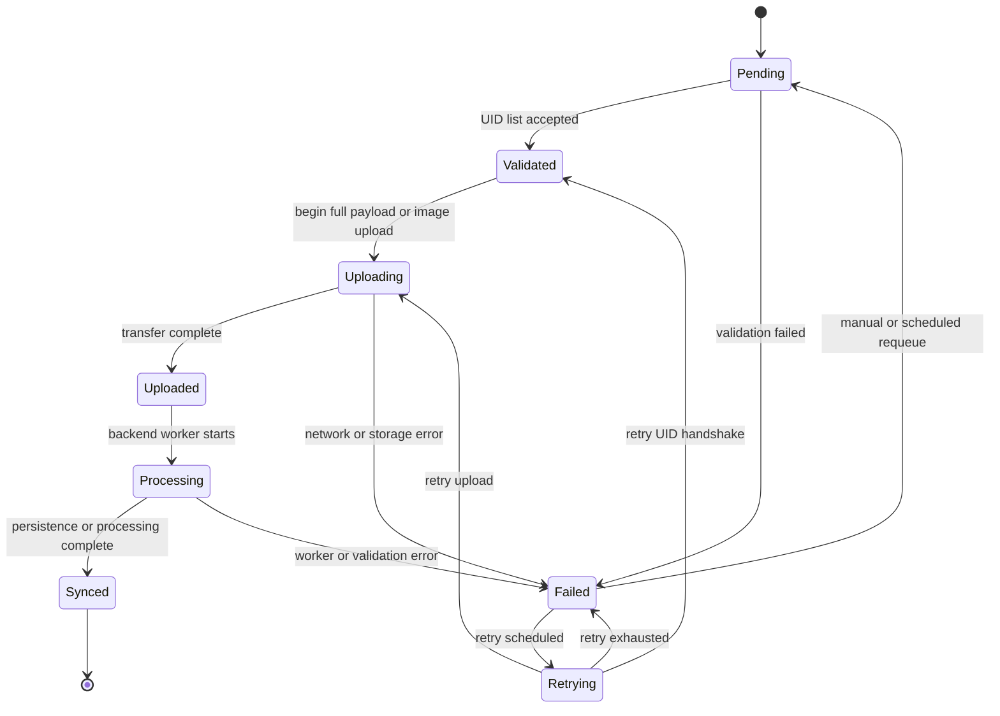
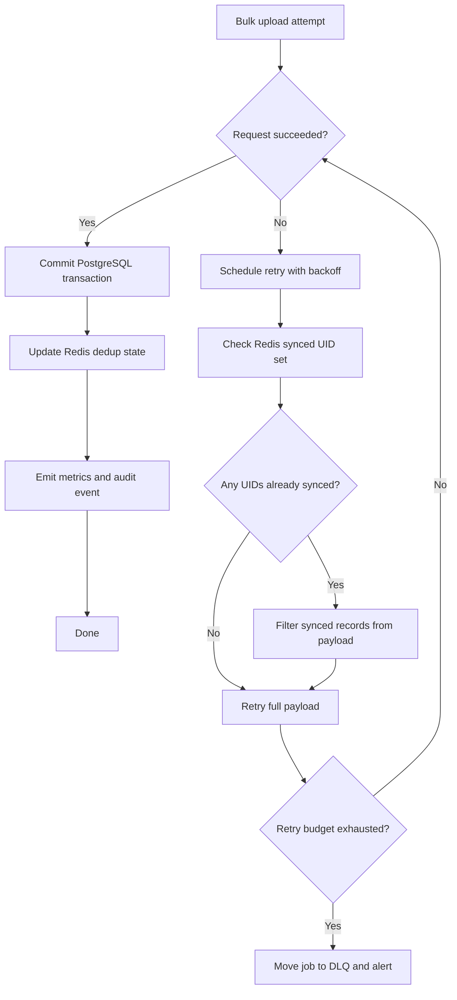

# C4 Model and Mermaid Diagrams

## C4 Level 1: System Context

### Actors and Systems

- Mobile app: captures data offline, syncs records, uploads images
- Browser client: accesses backend through the web interface
- Backend: coordinates sync, validation, persistence, upload authorization, and async work
- PostgreSQL: canonical data store
- Redis: ephemeral coordination and dedup store
- RabbitMQ: asynchronous job broker
- Storage service: binary object storage for media

### Boundaries

- The system of interest is the backend platform plus its persistence and async components.
- Mobile and browser are primary clients.
- Storage, queueing, and caching are supporting infrastructure dependencies.

## C4 Level 2: Container View

### Containers

- Mobile App
- Local SQLite
- Backend API
- Sync Service
- Background Workers
- PostgreSQL
- Redis
- RabbitMQ
- Storage Service

### Responsibilities

- Mobile App: local-first UX, orchestration of sync and uploads
- Local SQLite: offline persistence and sync metadata
- Backend API: request handling, validation, upload URL issuance
- Sync Service: cursor-based incremental sync
- Background Workers: image processing and asynchronous backend jobs
- PostgreSQL: source of truth for server-side records
- Redis: transient coordination for UID registration and sync dedup
- RabbitMQ: decoupling long-running tasks from request/response flows
- Storage Service: raw and processed image storage

## Mermaid Diagrams

### System Context Diagram

### Container Diagram

### Sync Data Flow Diagram

### Image Upload Flow

### Sync Sequence

### State Diagram

### Failure Recovery Diagram

